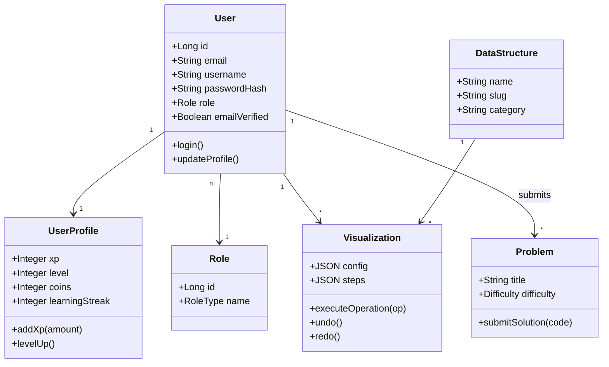
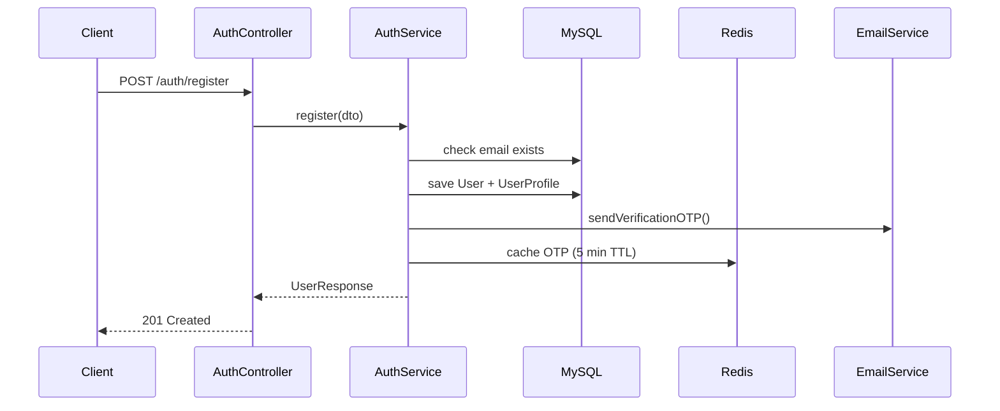
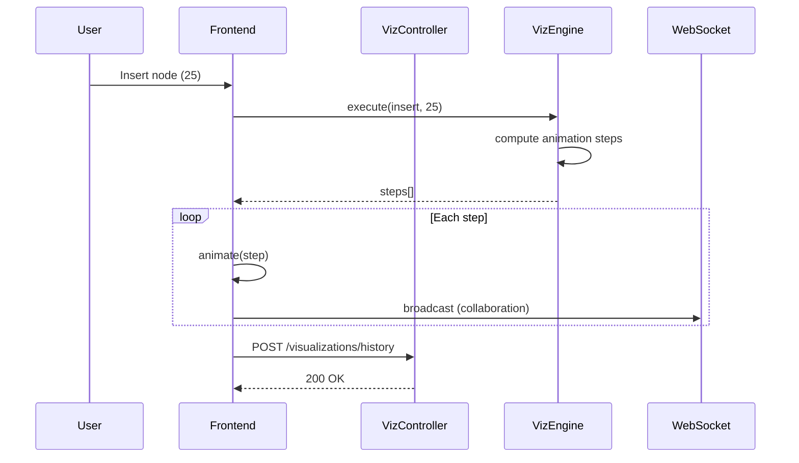
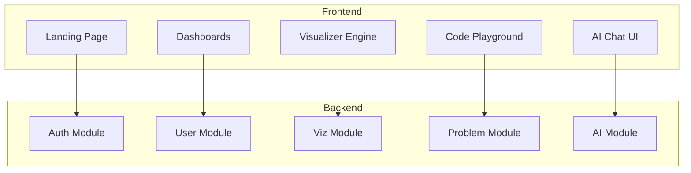

# AlgoVision AI — UML Diagrams

## Class Diagram (Core Domain)

```mermaid
classDiagram
    class User {
        +Long id
        +String email
        +String username
        +String passwordHash
        +Role role
        +Boolean emailVerified
        +login()
        +updateProfile()
    }

    class Role {
        +Long id
        +RoleType name
    }

    class UserProfile {
        +Integer xp
        +Integer level
        +Integer coins
        +Integer learningStreak
        +addXp(amount)
        +levelUp()
    }

    class DataStructure {
        +String name
        +String slug
        +String category
    }

    class Visualization {
        +JSON config
        +JSON steps
        +executeOperation(op)
        +undo()
        +redo()
    }

    class Problem {
        +String title
        +Difficulty difficulty
        +submitSolution(code)
    }

    User "1" --> "1" UserProfile
    User "n" --> "1" Role
    User "1" --> "*" Visualization
    DataStructure "1" --> "*" Visualization
    User "1" --> "*" Problem : submits
```

## Sequence Diagram — User Registration (Module 2)

```mermaid
sequenceDiagram
    participant C as Client
    participant API as AuthController
    participant S as AuthService
    participant DB as MySQL
    participant R as Redis
    participant E as EmailService

    C->>API: POST /auth/register
    API->>S: register(dto)
    S->>DB: check email exists
    S->>DB: save User + UserProfile
    S->>E: sendVerificationOTP()
    S->>R: cache OTP (5 min TTL)
    S-->>API: UserResponse
    API-->>C: 201 Created
```

## Sequence Diagram — DSA Visualization (Module 4)

```mermaid
sequenceDiagram
    participant U as User
    participant FE as Frontend
    participant API as VizController
    participant ENG as VizEngine
    participant WS as WebSocket

    U->>FE: Insert node (25)
    FE->>ENG: execute(insert, 25)
    ENG->>ENG: compute animation steps
    ENG-->>FE: steps[]
    loop Each step
        FE->>FE: animate(step)
        FE->>WS: broadcast (collaboration)
    end
    FE->>API: POST /visualizations/history
    API-->>FE: 200 OK
```

## Component Diagram

```mermaid
graph TB
    subgraph Frontend
        LP[Landing Page]
        DASH[Dashboards]
        VIZ[Visualizer Engine]
        PG[Code Playground]
        AI_UI[AI Chat UI]
    end

    subgraph Backend
        AUTH[Auth Module]
        USER[User Module]
        VIZ_API[Viz Module]
        PROB[Problem Module]
        AI_API[AI Module]
    end

    LP --> AUTH
    DASH --> USER
    VIZ --> VIZ_API
    PG --> PROB
    AI_UI --> AI_API
```
